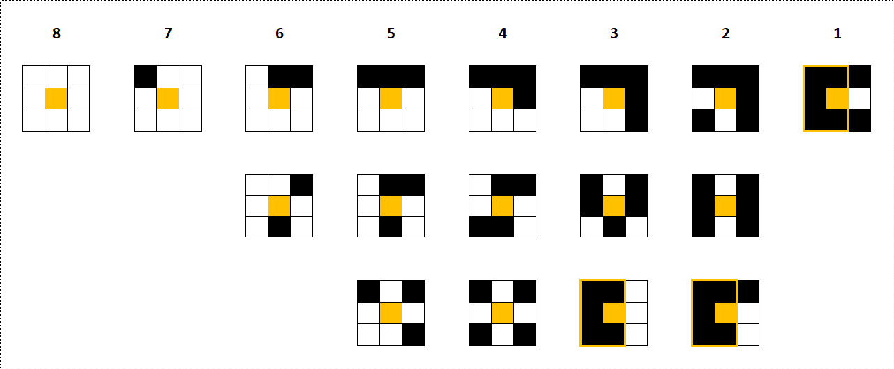

# Algo

Here we pre-compute each pixel to get:

- the maximum square area available from this pixel
- the isolation index of each pixel: the number of empty pixels around it

The more isolated a pixel, the less possibility there will be to fill it, so we first fill the most isolated with the most efficient square available.

We recompute, on each loop turn for each square compatible with our target pixel, the number of pixels that will actually be filled. When there are only pixels left with an isolation index of 1 or 0,
we finalize the filling starting from the last row.

See below various examples of index computation:



From index 3 we must also look at the position of empty pixels to eliminate indexes that would not be relevant because the target pixel can fit into a larger square. Thus, for indexes 2 and 3, the
result of the calculation is eliminated if the empty pixels are aligned.

Result is 3002 output instructions to draw the picture.

# C

```
root@raspberrypi:~/projet-smb215# perf stat -d -- taskset -c 0 ./algo-03/art-optimal.o
Res: 3102

 Performance counter stats for 'taskset -c 0 ./algo-03/art-optimal.o':

      46707.744624      task-clock (msec)         #    0.999 CPUs utilized          
               241      context-switches          #    0.005 K/sec                  
                 0      cpu-migrations            #    0.000 K/sec                  
             2,564      page-faults               #    0.055 K/sec                  
    65,212,704,425      cycles                    #    1.396 GHz                      (87.44%)
    50,959,578,906      instructions              #    0.78  insn per cycle           (87.52%)
     6,136,422,542      branches                  #  131.379 M/sec                    (87.52%)
        45,234,427      branch-misses             #    0.74% of all branches          (87.52%)
    22,348,962,436      L1-dcache-loads           #  478.485 M/sec                    (87.48%)
        18,941,577      L1-dcache-load-misses     #    0.08% of all L1-dcache hits    (87.52%)
       948,952,041      LLC-loads                 #   20.317 M/sec                    (87.50%)
       468,829,441      LLC-load-misses           #   49.40% of all LL-cache hits     (74.93%)

      46.750994584 seconds time elapsed
```

```
root@raspberrypi:~/projet-smb215# /usr/bin/time -v taskset -c 0 ./algo-03/art-optimal.o
Res: 3102
	Command being timed: "taskset -c 0 ./algo-03/art-optimal.o"
	User time (seconds): 46.44
	System time (seconds): 0.07
	Percent of CPU this job got: 99%
	Elapsed (wall clock) time (h:mm:ss or m:ss): 0:46.55
	Average shared text size (kbytes): 0
	Average unshared data size (kbytes): 0
	Average stack size (kbytes): 0
	Average total size (kbytes): 0
	Maximum resident set size (kbytes): 10624
	Average resident set size (kbytes): 0
	Major (requiring I/O) page faults: 0
	Minor (reclaiming a frame) page faults: 2591
	Voluntary context switches: 3
	Involuntary context switches: 273
	Swaps: 0
	File system inputs: 0
	File system outputs: 96
	Socket messages sent: 0
	Socket messages received: 0
	Signals delivered: 0
	Page size (bytes): 4096
	Exit status: 0
```

# Python3

```
root@raspberrypi:~/projet-smb215# perf stat -d -- taskset -c 0 python3 algo-03/art-optimal.py
Res: 3102

 Performance counter stats for 'taskset -c 0 python3 algo-03/art-optimal.py':

     467985,453558      task-clock (msec)         #    1,000 CPUs utilized          
              1579      context-switches          #    0,003 K/sec                  
                 0      cpu-migrations            #    0,000 K/sec                  
              3793      page-faults               #    0,008 K/sec                  
      654035045661      cycles                    #    1,398 GHz                      (87,50%)
      444223028874      instructions              #    0,68  insn per cycle           (87,50%)
       22462455796      branches                  #   47,998 M/sec                    (87,50%)
        7628372849      branch-misses             #   33,96% of all branches          (87,50%)
      226379651654      L1-dcache-loads           #  483,732 M/sec                    (87,50%)
         243034367      L1-dcache-load-misses     #    0,11% of all L1-dcache hits    (87,50%)
        1916890528      LLC-loads                 #    4,096 M/sec                    (87,50%)
         620934467      LLC-load-misses           #   32,39% of all LL-cache hits     (75,00%)

     468,144613421 seconds time elapsed
```

```
root@raspberrypi:~/projet-smb215# /usr/bin/time -v taskset -c 0 python3 algo-03/art-optimal.py
Res: 3102

	Command being timed: "taskset -c 0 python3 algo-03/art-optimal.py"
	User time (seconds): 466.55
	System time (seconds): 0.63
	Percent of CPU this job got: 99%
	Elapsed (wall clock) time (h:mm:ss or m:ss): 7:47.34
	Average shared text size (kbytes): 0
	Average unshared data size (kbytes): 0
	Average stack size (kbytes): 0
	Average total size (kbytes): 0
	Maximum resident set size (kbytes): 17336
	Average resident set size (kbytes): 0
	Major (requiring I/O) page faults: 0
	Minor (reclaiming a frame) page faults: 3827
	Voluntary context switches: 1
	Involuntary context switches: 1673
	Swaps: 0
	File system inputs: 0
	File system outputs: 96
	Socket messages sent: 0
	Socket messages received: 0
	Signals delivered: 0
	Page size (bytes): 4096
	Exit status: 0
```

# Javascript

```
root@raspberrypi:~/projet-smb215# perf stat -d -- taskset -c 0 node algo-03/art-optimal.js
Res: 3102

 Performance counter stats for 'taskset -c 0 node algo-03/art-optimal.js':

      44265,638780      task-clock (msec)         #    0,971 CPUs utilized          
              1569      context-switches          #    0,035 K/sec                  
                 0      cpu-migrations            #    0,000 K/sec                  
             13174      page-faults               #    0,298 K/sec                  
       61649288407      cycles                    #    1,393 GHz                      (87,50%)
       59584237228      instructions              #    0,97  insn per cycle           (87,50%)
        4032906821      branches                  #   91,107 M/sec                    (87,49%)
          96349287      branch-misses             #    2,39% of all branches          (87,53%)
       24633124911      L1-dcache-loads           #  556,484 M/sec                    (87,53%)
          29419245      L1-dcache-load-misses     #    0,12% of all L1-dcache hits    (87,55%)
         488686225      LLC-loads                 #   11,040 M/sec                    (87,44%)
         218199870      LLC-load-misses           #   44,65% of all LL-cache hits     (74,97%)

      45,586042572 seconds time elapsed
```

```
root@raspberrypi:~/projet-smb215# /usr/bin/time -v taskset -c 0 node algo-03/art-optimal.js
Res: 3102

	Command being timed: "taskset -c 0 node algo-03/art-optimal.js"
	User time (seconds): 43.81
	System time (seconds): 0.17
	Percent of CPU this job got: 99%
	Elapsed (wall clock) time (h:mm:ss or m:ss): 0:43.99
	Average shared text size (kbytes): 0
	Average unshared data size (kbytes): 0
	Average stack size (kbytes): 0
	Average total size (kbytes): 0
	Maximum resident set size (kbytes): 46164
	Average resident set size (kbytes): 0
	Major (requiring I/O) page faults: 0
	Minor (reclaiming a frame) page faults: 12902
	Voluntary context switches: 503
	Involuntary context switches: 693
	Swaps: 0
	File system inputs: 0
	File system outputs: 96
	Socket messages sent: 0
	Socket messages received: 0
	Signals delivered: 0
	Page size (bytes): 4096
	Exit status: 0
```

# PHP

```
root@raspberrypi:~/projet-smb215# perf stat -d -- taskset -c 0 php -f algo-03/art-optimal.php
Res: 3102

 Performance counter stats for 'taskset -c 0 php -f algo-03/art-optimal.php':

     284972,987207      task-clock (msec)         #    0,999 CPUs utilized          
              1133      context-switches          #    0,004 K/sec                  
                 0      cpu-migrations            #    0,000 K/sec                  
              6184      page-faults               #    0,022 K/sec                  
      397864673756      cycles                    #    1,396 GHz                      (87,50%)
      291322976233      instructions              #    0,73  insn per cycle           (87,49%)
       31598084437      branches                  #  110,881 M/sec                    (87,50%)
         747612612      branch-misses             #    2,37% of all branches          (87,50%)
      178922205842      L1-dcache-loads           #  627,857 M/sec                    (87,50%)
         165377318      L1-dcache-load-misses     #    0,09% of all L1-dcache hits    (87,50%)
        1370832271      LLC-loads                 #    4,810 M/sec                    (87,50%)
         522706672      LLC-load-misses           #   38,13% of all LL-cache hits     (75,00%)

     285,135835898 seconds time elapsed
```

```
root@raspberrypi:~/projet-smb215# /usr/bin/time -v taskset -c 0 php -f algo-03/art-optimal.php
Res: 3102

	Command being timed: "taskset -c 0 php -f algo-03/art-optimal.php"
	User time (seconds): 282.79
	System time (seconds): 0.29
	Percent of CPU this job got: 99%
	Elapsed (wall clock) time (h:mm:ss or m:ss): 4:43.22
	Average shared text size (kbytes): 0
	Average unshared data size (kbytes): 0
	Average stack size (kbytes): 0
	Average total size (kbytes): 0
	Maximum resident set size (kbytes): 28560
	Average resident set size (kbytes): 0
	Major (requiring I/O) page faults: 0
	Minor (reclaiming a frame) page faults: 6208
	Voluntary context switches: 1
	Involuntary context switches: 1143
	Swaps: 0
	File system inputs: 0
	File system outputs: 96
	Socket messages sent: 0
	Socket messages received: 0
	Signals delivered: 0
	Page size (bytes): 4096
	Exit status: 0
```

# Java

```
root@raspberrypi:~/projet-smb215# perf stat -d -- taskset -c 0 java -cp algo-03 ArtOptimal
Res: 3102

 Performance counter stats for 'taskset -c 0 java -cp algo-03 ArtOptimal':

      17883,435525      task-clock (msec)         #    0,999 CPUs utilized          
              1726      context-switches          #    0,097 K/sec                  
                 0      cpu-migrations            #    0,000 K/sec                  
              7929      page-faults               #    0,443 K/sec                  
       24952664151      cycles                    #    1,395 GHz                      (87,49%)
       21400027420      instructions              #    0,86  insn per cycle           (87,56%)
        2063169426      branches                  #  115,368 M/sec                    (87,54%)
         147939775      branch-misses             #    7,17% of all branches          (87,41%)
        6978257202      L1-dcache-loads           #  390,208 M/sec                    (87,47%)
          64290870      L1-dcache-load-misses     #    0,92% of all L1-dcache hits    (87,55%)
         569087532      LLC-loads                 #   31,822 M/sec                    (87,52%)
         214975295      LLC-load-misses           #   37,78% of all LL-cache hits     (74,95%)

      17,895897471 seconds time elapsed
```

```
root@raspberrypi:~/projet-smb215# /usr/bin/time -v taskset -c 0 java -cp algo-03 ArtOptimal
Res: 3102

	Command being timed: "taskset -c 0 java -cp algo-03 ArtOptimal"
	User time (seconds): 18.30
	System time (seconds): 0.14
	Percent of CPU this job got: 99%
	Elapsed (wall clock) time (h:mm:ss or m:ss): 0:18.47
	Average shared text size (kbytes): 0
	Average unshared data size (kbytes): 0
	Average stack size (kbytes): 0
	Average total size (kbytes): 0
	Maximum resident set size (kbytes): 42292
	Average resident set size (kbytes): 0
	Major (requiring I/O) page faults: 8
	Minor (reclaiming a frame) page faults: 8067
	Voluntary context switches: 711
	Involuntary context switches: 989
	Swaps: 0
	File system inputs: 0
	File system outputs: 160
	Socket messages sent: 0
	Socket messages received: 0
	Signals delivered: 0
	Page size (bytes): 4096
	Exit status: 0
```